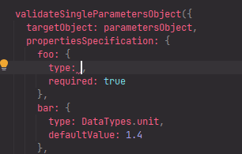

# Basic constants

Because the Stylus pre-processor does not allow to define the readonly variables, the **constant** term is *conventional*.


## DataTypes - Stylus data types

[](https://plugins.jetbrains.com/plugin/17677-yamato-daiwa-frontend)



Pseudo enumeration including the data types related with supported by Stylus pre-processor data types.
Please note that it does *not* include possible returnable values of **typeof()** build-in function because 
**Yamato Daiwa Frontend** distinguishing the data types more precisely thus abstracting from Stylus native notations.
Frequently being used for parameters validation of mixins and functions. 

```stylus
DataTypes = {
  dimensionalAmount: "DIMENSIONAL_AMOUNT"
  dimensionlessAmount: "DIMENSIONLESS_AMOUNT",
  string: "STRING",
  boolean: "BOOLEAN",
  object: "OBJECT",
  colorDefinition: "COLOR_DEFINITION"
}
```

The notable types are **dimensionalAmount** and **dimensionlessAmount**. For the Stylus, both `typeof(2)` and `typeof(2px)`
are `unit` while sometimes dimensional amount only or dimensionless amount (AKA "unitless value" in CSS) only allowed.

The target of Live Template for this functionality is to compensate not implemented autocomplete for Stylus objects (hashes)
in IntelliJ IDEA.


## NARROWEST_SCREEN_WIDTH_UNIT - The narrowest screen width unit

[](https://plugins.jetbrains.com/plugin/17677-yamato-daiwa-frontend)


`NARROWEST_SCREEN_WIDTH_UNIT` is equals **320px**.
It is the iPhone 5 screens width and currently just a small percentage of mobile devices has narrower than **320px** screens.

Is responsive/adaptive layout, the minimal grid width is frequently being set to `NARROWEST_SCREEN_WIDTH_UNIT` and maximal 
grid width is being frequently set to the multiple of `NARROWEST_SCREEN_WIDTH_UNIT`:

* `2 * NARROWEST_SCREEN_WIDTH_UNIT = 640px`
* `3 * NARROWEST_SCREEN_WIDTH_UNIT = 960px`
* `4 * NARROWEST_SCREEN_WIDTH_UNIT = 1280px`
