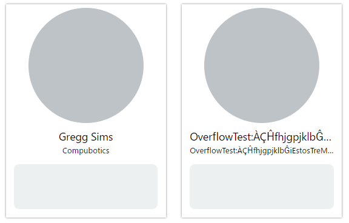

# `textOverflowSafetyTest` - Text Overflow Testing

The string constant intended to be used for testing of text overflow adaptation.
Should be used only for testing purposes (not for production).

Contains the below string value:

```javascript
"OverflowTest:ÀÇĤfhjgpjklbĜiEstosTreMalfacileEnvolverLaVicoAbcdefghijklmnopqrstuvwxyz" +
"abcdefgghijklmnopqrstuvwxyzabcdefghijklmnopqrstuvwxyzabcdefghijklmnopqrstuvwxyzabcdefghijklmnopqrstuvwxyzabcdefghi" +
"jklmnopqrstuvwxyzabcdefghijklmnopqrstuvwxvwxyzabcdefghijklmnopqrstuvwxyzabcdefghijklmnopqrstuvwx";
```

<figure>
  
  <figcaption align="center">The right card is using <code>YDF.textOverflowSafetyTest</code> constant for test.</figcaption>
</figure>


## Common Usage Patterns
### Commenting Out

Keep the commended out element containing the value of `YDF.textOverflowSafetyTest` near the element with normal content.
Recommend to use the `//-` comment which does not cause the HTML comment output. 

```pug
mixin Card(person)

  .Card
  
    //- span.Card-FullNameLabel= peron.fullName
    span.Card-FullNameLabel= YDF.textOverflowSafetyTest
    
    //- span.Card-OrganizationNameLabel= peron.organizationName 
    span.Card-OrganizationNameLabel= YDF.textOverflowSafetyTest
```


### Including to Mock Data

If you are using the iterative rendering of some data, include the entity with `YDF.textOverflowSafetyTest` to your data.

```pug
-

  const fruits = [
    {
      name: "Apple",
      price__dollars: 1
    },
    {
      name: YDF.textOverflowSafetyTest,
      price__dollars: 2
    },
    {
      name: "Orange",
      price__dollars: 3
    }
  ]


mixin FruitCard(fruit)

  li.FruitCard
  
    span.FruitCard-NameLabel= fruit.name
    span.FruitCard-PriceLabel= `${ fruit.price } $`


ul

  each fruit in fruits
  
    +FruitCard(fruit)
```
